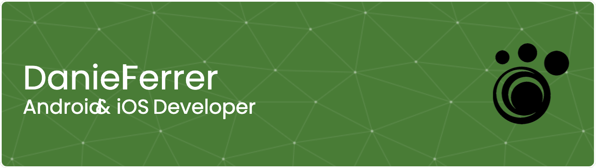

### Hi there 👋 My name is Daniel Ferrer. I'm Android & iOS Developer

##### In 2003 I started as a developer, first on the web. Doing small business development on my own. In 2007 I did one of the developments that I liked the most, an elearning website for the employees of a large bank in Spain. In its first hour of life, 1,000 users registered and at the end of the day we already had 5,000 registered users. Although I am no longer in that company, today, 14 years later, that project is still very much alive, which is a great pride.

#### In 2010 I discovered Android, 2.2 was the version that existed at the time. I created and published some applications on my own. Meanwhile I continued developing web in several companies.

#### In 2015, in the company where I am currently, I got a position as an Android developer. Due to the size of the team and the needs of the company, I have had the opportunity to learn iOS development.

#### Today I develop native applications, Android and iOS. Using Jetpack components in Android, and views with Compose. On the iOS part I use Swift and SwiftUI.

<!--  -->

<!--
**3pies/3pies** is a ✨ _special_ ✨ repository because its `README.md` (this file) appears on your GitHub profile.

Here are some ideas to get you started:

- 🔭 I’m currently working on ...
- 🌱 I’m currently learning ...
- 👯 I’m looking to collaborate on ...
- 🤔 I’m looking for help with ...
- 💬 Ask me about ...
- 📫 How to reach me: ...
- 😄 Pronouns: ...
- ⚡ Fun fact: ...
-->

### 🌐 You can find me here

 )  ) 

### 💻 Skills

  

   

    

 

 

    

  

       
 
### 📊GitHub Stats :
 
 

### 🏆GitHub Trophies

---

